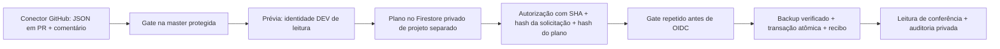

# Administração de dados pelo GitHub

## Situação da implantação em 09/10/2026

O executor permanente está nesta PR de infraestrutura, separado do PR #28. **Ainda não está liberado para operações reais.** As duas contas DEV, os papéis personalizados e a federação foram criados e conferidos na API. O snapshot privado foi compartilhado como leitor com ambas as contas. A `master` agora exige PR, uma aprovação, descarte de aprovações antigas, aprovação do último push por outra pessoa e CI `validate`, inclusive para administradores. Os ambientes `data-dev-preview` e `data-dev-execute` aceitam exclusivamente a branch `master`, sem tags e sem bypass administrativo.

**Faturamento é proibido nesta infraestrutura.** DEV permanece Spark, sem conta de faturamento. O arquivo privado usa um Firestore Standard `(default)` em projeto separado, `bem-feito-archive-dev`, também sem faturamento. O bucket GCS foi descartado. Faltam aprovar e provisionar esse projeto de arquivos e os vínculos mínimos descritos abaixo, revisar/integrar esta PR e executar o smoke test por OIDC. Nenhum documento de negócio DEV foi modificado; não houve merge do PR #28, migração ou acesso a dados PROD.

PROD permanece `null` em `tools/data-admin/config.json`: somente `bem-feito-dev` foi encontrado nas configurações e projetos Firebase acessíveis; o ambiente Angular de produção contém placeholders. Nenhum Project ID, identidade ou bucket PROD foi inventado. O executor rejeita qualquer solicitação PROD enquanto faltar configuração real revisada.

## Arquitetura e fronteiras de confiança



`.github/workflows/data-admin.yml` é o único executor permanente. PRs fornecem apenas um JSON, obtido pela API em um SHA imutável; o job privilegiado sempre faz checkout do SHA da `master` usado pelo workflow. Nenhum script do PR recebe credenciais. Para migração, os testes de regras e transações da aplicação do PR #28 rodam em outro job, em emulador, sem OIDC, credenciais de nuvem, token de escrita ou caches compartilhados.

O gate consulta a permissão atual do autor (`write`, `maintain` ou `admin`), compara seu ID com o principal retornado pela API, reconsulta o comentário e exige autor, sender, actor e triggering_actor coincidentes. Rejeita comentário editado, bot, PR fechado, fork, SHA antigo, rerun, branch ou ambiente incorreto. Uma solicitação autorizada pode conter somente as operações e campos do schema. Shell, SQL, JavaScript, consultas arbitrárias e credenciais não são aceitos.

A proteção da branch torna a revisão independente indispensável para mudanças no executor. `CODEOWNERS` identifica os arquivos sensíveis; a regra exige aprovação de outro colaborador com escrita, sem dispensar administradores. Se não houver esse colaborador, o proprietário precisa indicar um revisor confiável; o autor não pode aprovar seu próprio código.

## Identidades, IAM e OIDC

| Identidade DEV | Firestore `(default)` | Arquivo privado planejado |
|---|---|---|
| `github-data-dev-read@bem-feito-dev.iam.gserviceaccount.com` | `datastore.databases.get`, `getMetadata`, `entities.get`, `entities.list` | Ler e criar documentos no arquivo separado; o executor cria somente planos e auditoria de prévia |
| `github-data-dev@bem-feito-dev.iam.gserviceaccount.com` | Leitura anterior + `entities.create`, `update`, `delete` | Ler e criar documentos no arquivo separado; o executor cria backups e auditoria |

Os papéis DEV são `dataAdminRead` e `dataAdminWrite`, condicionados a `resource.name == 'projects/bem-feito-dev/databases/(default)'`. O papel no projeto de arquivos é `dataArchiveAppend`: somente `datastore.databases.getMetadata`, `datastore.entities.get` e `datastore.entities.create`, condicionado ao `(default)` desse projeto. Não tem update, delete, list, export, IAM ou permissões de outro banco. Prefixos e campos são controlados pelo executor; IAM é limitado ao banco, não às coleções. Cada escrita no arquivo exige `exists:false`, usa nomes derivados do hash e não sobrescreve. As regras do projeto de arquivos negam todas as leituras/gravações por clientes Firebase; apenas IAM autorizado acessa os dados privados. Nenhuma identidade técnica recebe Owner, Editor, Auth, Hosting, IAM ou PROD. A identidade `github-deploy` e seu provider permanecem destinados ao deploy.

Provider novo: `projects/312978463343/locations/global/workloadIdentityPools/github-data/providers/github`. Emissor: `https://token.actions.githubusercontent.com`. Exige repositório `EwertonMendes/bem-feito-web`, repository ID `1406056807`, owner ID `33728924`, branch `refs/heads/master`, ref type `branch`, workflow `EwertonMendes/bem-feito-web/.github/workflows/data-admin.yml@refs/heads/master`, runner GitHub hospedado, evento `issue_comment` ou `workflow_dispatch` e ambiente DEV específico. O subject é `github:<repository_id>:<environment>`; cada conta aceita somente o subject de sua fase, por `roles/iam.workloadIdentityUser`. Não há chaves estáticas. O claim OIDC não substitui a consulta da proteção atual da branch feita pelo gate.

O bootstrap administrativo é `node tools/data-admin/provision.mjs` (plano) e `node tools/data-admin/provision.mjs --apply` (recursos aprovados). Para o projeto de arquivos, crie primeiro o projeto Firebase gratuito pelo CLI e execute `node tools/data-admin/provision-archive.mjs --apply`, que habilita somente Firestore Standard, proteção de exclusão e regras deny-all. Ambos usam a sessão existente do proprietário, com `FIREBASE_TOOLS_MODULE` apontando ao package.json instalado do CLI, e abortam se houver faturamento vinculado. Não persistem/imprimem tokens e não executam operações de negócio. Reexecução preserva vínculos/etags e recusa diferenças de confiança ou proteção.

## Pedidos pelo conector GitHub

1. Leia esta documentação e `tools/data-admin/schema.ts` na `master`. Crie uma branch no próprio repositório e um JSON `operations/requests/<nome>.json`. Use ID novo para cada intenção; não inclua dados de clientes. Abra PR contra `master` e obtenha o SHA atual de 40 caracteres. O PR de solicitação permanece aberto durante a operação.
2. Publique no PR um comentário pelo conector autenticado como usuário com escrita:

   ```text
   /data-admin preview operations/requests/<nome>.json <SHA_DO_PR>
   ```

3. Localize a execução **Firebase data administration** em Actions, iniciada pelo comentário. Leia `requestHash`, `planHash`, `requestSha`, caminhos e valores numéricos no resumo do job `operation`. Preview não escreve no banco de negócio; salva plano e auditoria no projeto privado separado.
4. Confira destino, documentos, valores e pré-condições. Em DEV, a autorização específica é outro comentário com os hashes exatos da prévia:

   ```text
   /data-admin apply operations/requests/<nome>.json <SHA_DO_PR> <REQUEST_HASH> <PLAN_HASH>
   ```

5. Confira a conclusão e o resumo: `status: complete`, `validation: readback-verified`, documentos afetados e hash `backup`. Uma repetição com o mesmo ID e conteúdo retorna `already-complete` após verificar o estado atual. Nunca autorize automaticamente um hash diferente porque houve mudança concorrente; faça outra prévia e obtenha nova autorização.

O conector precisa criar commits/PRs/comentários como o usuário autorizado e ler Actions. Um bot GitHub App com principal próprio é recusado. Não é necessário terminal, acesso direto ao Firebase ou chave privada para operações rotineiras. `workflow_dispatch` também aceita PR, path, sha, mode, request_hash e plan_hash na `master`; é a única forma de aplicar em PROD. Não há endpoint HTTP público.

Exemplo de custo: copie `operations/examples/input-cost.json` para requests, substitua o ID do insumo, informe custo anterior e novo em centavos inteiros. O executor recalcula a base de custo, preservando estoque físico, reservado e comprometido. Cadastros simples podem ser criados; alterações financeiras/estoque, troca de propriedade de fragrância ou troca de vínculos de preço exigem migração de domínio registrada e revisada. Delete genérico aceita somente `dataAdminSmoke/smoke-*`; exclusões de negócio são restritas à substituição DEV registrada. Leia o schema para a lista completa de coleções e campos.

## PROD

Após identificar o projeto real, configure contas reader/writer, provider e projeto de arquivos independente em uma PR revisada, mantendo a restrição de não vincular faturamento. Cadastre IDs humanos em `productionApprovers`; configure `data-prod-preview` e `data-prod-execute` exclusivamente para `master`, com revisores, prevenção de autoaprovação e `can_admins_bypass: false`. O repositório público atual oferece esses controles de Environment; mudança de visibilidade/plano exige reavaliação.

Um humano autorizado deve despachar **apply** com PR, SHA e ambos os hashes específicos. O job para antes de OIDC na aprovação protegida e revalida tudo após a aprovação. Aprovação de PR, push, merge, comentário, CI ou permissão de escrita isoladamente não executam PROD. Sem revisor diferente do solicitante, a operação permanece bloqueada. O provisionador PROD exige configuração real, separada de DEV, e autorização administrativa para seus vínculos.

## Backup, auditoria e recuperação

Arquivo privado planejado: Firestore Standard `(default)` de `bem-feito-archive-dev`, região `southamerica-east1`, sem faturamento, independente do banco substituível. Retenção indefinida, sem TTL ou exclusão automática, preservando o mínimo de 90 dias. Contas técnicas não recebem update/delete/list nem administração do banco. Proteção de exclusão do banco e regras de cliente deny-all são verificadas pelo provisionador. Administradores do projeto continuam responsáveis por não alterar/excluir arquivos sem revisão; não há promessa de retenção legal irrevogável.

O free tier oferece 1 GiB armazenado, 50 mil leituras/dia e 20 mil escritas/dia por projeto ([cotas oficiais](https://firebase.google.com/docs/firestore/quotas)). Cada projeto tem somente seu banco gratuito; nenhum serviço pago, GCS, backup nativo pago, PITR ou faturamento é habilitado. Ao atingir a cota, a operação falha fechada, sem mudar o negócio e sem upgrade automático. O proprietário acompanha o armazenamento no console e pode arquivar manualmente cópias fora do serviço após a retenção mínima. Gratuito não significa armazenamento ilimitado.

Planos, backups e auditorias usam SHA-256 do conteúdo em `archive-plans`, `archive-backups` e `archive-audit`. JSON privado é fragmentado em blocos de até 400 KB, com checksum SHA-256 individual, para respeitar o limite de 1 MiB por documento. Manifesto e fragmentos são criados atomicamente com `exists:false`. A leitura independente remonta o JSON e confere tamanho, checksums e hash completo antes da primeira gravação de negócio. Repetição relê o arquivo existente sem sobrescrever. Nenhum arquivo privado vira artefato público do Actions; relatórios ocultam strings e estruturas internas.

Antes da transação, há backup e evento `intent` privado com ator, SHA do pedido, SHA do executor, run/comment IDs, horário, escopo, hashes e referência ao backup. A transação verifica versões e relações, aplica todas as alterações, invalida as revisões de dados da aplicação e cria o recibo `dataAdminOperations/<id>`. Uma leitura posterior confere conteúdo e, na migração, o conjunto exato de documentos nas raízes; gera evento `verified`. Repetições geram evento `replay`. Os arquivos de auditoria ficam fora das coleções substituíveis.

Cada operação suporta até 2.000 documentos e 4 MB de linhas codificadas, além dos limites de tamanho/índices/tempo impostos pelo servidor. Firestore removeu o antigo limite de 500 escritas por transação em 2023 ([notas oficiais](https://docs.cloud.google.com/firestore/docs/release-notes#March_29_2023)); os limites de [10 MiB e duração](https://firebase.google.com/docs/firestore/quotas) continuam relevantes. Pedidos genéricos têm no máximo 200 alvos. Não há divisão em lotes que deixe negócio parcialmente substituído; exceder limites aborta sem alterações.

Falha antes ou durante commit mantém o estado anterior pela atomicidade. Falha de rede/conferência após commit não dispara rollback cego: consulte o recibo e o evento privado, repita o mesmo pedido para verificar, ou use restore específico. Isso evita apagar mudanças concorrentes.

Para restaurar, crie outra solicitação:

```json
{
  "schemaVersion": 1,
  "id": "dev-restore-unique-v1",
  "environment": "dev",
  "projectId": "bem-feito-dev",
  "operation": "restore",
  "backup": "<SHA256_DO_BACKUP>",
  "destructive": { "projectId": "bem-feito-dev", "paths": ["<ESCOPO_EXATO_DO_BACKUP>"] }
}
```

Repita preview/apply com SHA e hashes novos. Para migração, `paths` é a lista de coleções e `system/bank-snapshot` original. Restore valida destino, caminhos, versões e relações; restaura tipos Firestore sem perda e faz outro backup. Documentos novos fora do backup nas coleções abrangidas bloqueiam a recuperação para revisão. Não copie conteúdo privado ao PR. O hash do resumo corresponde a `archive-backups/<hash>` e seus descendentes `parts/` no [Firestore do arquivo privado](https://console.firebase.google.com/project/bem-feito-archive-dev/firestore/databases/-default-/data).

## Liberação e smoke test obrigatório

1. Aprove a criação gratuita do projeto separado e os vínculos mínimos de arquivo. Não vincule faturamento a nenhum projeto. Execute `provision-archive.mjs --apply` e `provision.mjs --apply`; confira bancos, regras, proteção e IAM pela API.
2. Outro colaborador com escrita revisa o código, com CI passando, e integra somente esta PR de infraestrutura à `master`. Não faça merge do PR #28. Não use executor de branch de PR com credenciais para testar antes da revisão.
3. Abra um PR com os quatro arquivos `dev-smoke-*.json` e o pedido de migração. Inspect por preview: ausente. Create: 10; repita apply para idempotência. Update: 20. Restore com backup do update: volta a 10. Delete e inspect: `exists: false`. Confira os arquivos privados e recibos. Verifique também que as identidades do arquivo não podem atualizar/excluir o documento de teste do arquivo antes de confiar nas permissões reais. Nenhum dado real precisa ser modificado.
4. Execute preview da migração para verificar ADC/Drive, fonte, projeto, capacidade, estado DEV e backup/plano privado. Não publique apply da migração durante a validação da infraestrutura.
5. Somente depois do sucesso real desse fluxo, retire `.github/workflows/migration-dev-trusted-temporary.yml` por PR revisada e revogue a leitura do snapshot concedida à antiga `github-deploy`. Não use mais os comandos temporários. Esta PR não concede escrita à identidade antiga.

O teste negativo real `deny-untrusted-data-oidc` passou com HTTP 400 `unauthorized_client`, sem credenciais. O gate também cobre falta de escrita, forks, SHA antigo, comentário alterado, rerun, branch desprotegida e PROD. A suíte do emulador usa `demo-bem-feito` e `demo-bem-feito-archive`: dry-run, backup/restore, concorrência, relações, idempotência, colisão, 600 documentos atômicos e arquivo separado com fragmentação/checksums. Isso não comprova IAM real. Os testes positivos OIDC/Firestore e negações IAM reais continuam pendentes dos passos 1–3.

## Migração do PR #28

Pedido preparado: `operations/requests/dev-migration-20261009.json`. Registro permitido: `legacy-sheets-v1`, somente `bem-feito-dev`. O planner exige que o SHA indicado continue sendo o head do PR #28 aberto e não integrado, tenha CI push bem-sucedida e esteja publicado no `deployment.json` do DEV. Os jobs isolados executam os testes de transações e regras da aplicação antes de credenciais administrativas.

Reutiliza fetch, convert, normalize, reconcile e validate inspecionados no SHA `08d4951142881bc2f34aaae46c4ebbd07063cc75` do PR #28. Os wrappers import/verify/replace e o backup no mesmo banco foram substituídos pela transação e arquivo em projeto independente. Leitura exclusiva do snapshot privado; jamais altera a planilha oficial.

Prévia exporta de novo, normaliza e concilia, exige 0 erros, 25 vendas, 24 recebimentos, 45 produções, 16 despesas, saldo 48.169 centavos, aportes em bens 85.311 centavos, V00024 em produção e V00025 pronta. A exportação privada conferida nesta tarefa passou com 0 erros e 19 avisos de custo ausente, que não foram preenchidos artificialmente. Tem 463 documentos de negócio conciliados; a união dos atuais e futuros soma 569 raízes, além de descendentes históricos explicitamente aceitos e backupados. Alteração de fonte ou versão do destino entre preview/apply exige nova autorização.

Substitui somente as 21 coleções listadas no pedido e `system/bank-snapshot`, preservando Auth, `users`, integrações, recibos e configurações estruturais. Descendentes não registrados bloqueiam o plano. Backup integral dos documentos abrangidos precede a transação. Conferência compara cada conteúdo e os conjuntos exatos de IDs; registros antigos ausentes da fonte são excluídos, incluindo dados fictícios. E2E do negócio ocorre exclusivamente no emulador. Se o aplicativo mudar no PR #28, atualize `deploymentSha` no JSON e obtenha novos hashes; não reautorize uma versão diferente implicitamente.

Instrução para outra instância do ChatGPT, **após liberação e smoke test**:

> Em EwertonMendes/bem-feito-web, sem merge do PR #28 e sem faturamento, use data-admin.yml e legacy-sheets-v1 no DEV bem-feito-dev. Abra PR com operations/requests/dev-migration-20261009.json atualizado ao SHA do PR #28 publicado. Pelo conector, comente /data-admin preview com caminho e SHA do novo PR; confira totais, E2E isolados e hashes. Com autorização do proprietário para esse plano, comente /data-admin apply com caminho, SHA, requestHash e planHash exatos. Confira readback-verified, IDs da fonte e ausência dos IDs antigos fora dela; informe o link da execução e archive-backups/<backup> no projeto bem-feito-archive-dev. Preserve o backup para restore e não execute PROD.

## Revogação e manutenção

Para interromper operações, desabilite o workflow em Actions e o provider novo `github-data/github` no projeto DEV. Remova `roles/iam.workloadIdentityUser` da conta/fase comprometida ou desabilite a conta; revogue acesso ao snapshot em Drive. Não toque no provider `github-actions/github` usado pelo deploy. Credenciais já emitidas expiram; a revogação do vínculo não apaga backups. O proprietário deve revisar recibos/auditoria antes de retomar.

Toda ampliação de operação/coleção/campo, destino PROD, aprovador ou confiança OIDC passa por PR revisada. Fixe Actions em SHAs revisados e mantenha dependências/lockfile. Configure a retenção de auditoria de acordo com o uso real, preservando o mínimo aprovado; não crie exclusão automática de backups como parte de uma operação de negócio.
